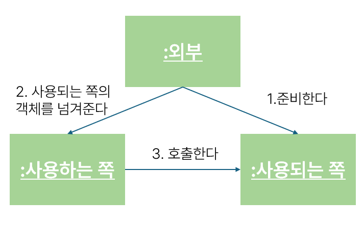

# DI의 개념

## DI의 목적

| 💡 DI로 하려는 일은 간단히 말해 프로그래의 부분적인 전환을 쉽게 만드는 것

ex)

serviceimple → **repository(interface)**

jdbcRepository(실제 DB접근) | mockRepository(DB접근 X)

이런식으로 구현되어 있으면 운영 시에는 jdbc를 사용하고, test에는 mock을 사용하는 식으로 갈아 끼울수 있음

## DI 사용법

- 나는 갈아끼우고 싶은데 ? 매번 new해서 test하고 다시 운영하는 객체로 고치고 이러기 너무 번거로워요
- 그렇다면 외부에서 객체를 생성하고 , service에서 걔를 호출하는 방식으로 바꾸면 됨

### **예제**

interface repository

```java
public interface TrainingRepository {
    List<Training> selectAll();
}
```

test용 respository

```java
public class MockTrainingRepository implements TrainingRepository {
    @Override
    public List<Training> selectAll() {
        // 테스트용으로 적당한 데이터를 준비한다.
        return null;
    }
}
```

prod용 repository

```java
public class JdbcTrainingRepository implements TrainingRepository{
    @Override
    public List<Training> selectAll() {
        // 데이터베이스에서 데이터를 가져온다
        return null;
    }
}
```

service

```java
public class TrainingServiceImpl implements TrainingService {
    private TrainingRepository trainingRepository;

    public TrainingServiceImpl(TrainingRepository trainingRepository) {
        this.trainingRepository = trainingRepository;
    }
    
    public List<Training> findAll() {
        return trainingRepository.selectAll();
    }
}
```

외부 코드

```java
//운영용
TrainingRepository trainingRepository = new JdbcTrainingRepository();
TrainingService trainingService = new TrainingServiceImpl(trainingRepository);

테스트용
TrainingRepository trainingRepository = new MockTrainingRepository();
TrainingService trainingService = new TrainingServiceImpl(trainingRepository);
```

> 이렇게 하면 traingRepository 는 interface이므로 test용이 오던, 운영 용이 오던 serivceimpl을 수정할 필요가 없음!
>

**❓환경에 따른 외부는 어떻게 설정하나요 ❓**

‼️ 운영은 main함수에 / 테스트는 JUnit 테스트 메서드에 작성

이렇게 하면 객체를 전환할 때 TrainingServiceImpl 클래스의 소스코드를 수정할 필요가 없다

## 다시 DI란?

| 💡 사용되는 객체를 사용하는 객체 외부에서 생성하여 전달받는 사고방식




- 사용하는 객체는 사용되는 객채에 의존한다
    - 사용하는 객체가 어떤 처리를 할 때 사용되는 객체의 메서드를 호출해야함 == 사용하는 객체는 사용되는 객체가 없어서는 안되는 존재임
- 사용되는 객체 = 의존 객체

- 만약 구현할 클래스가 하나라면 굳이 인터페이스를 사용하지 않고 Mock용 라이브러리를 사용하면 간단히 전환할 수 있다
    - Mock용 라이브러리는 의존 객체의 구상클래스의 서브클래스를 자동으로 생성해준다
- 동일한 타입의 Serivce, Repository를 여러개 만들어야한다면 interface를 사용하는 것이 좋다