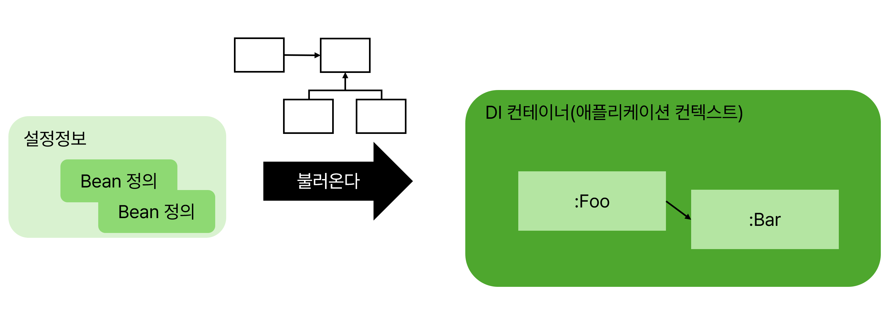

# DI 컨테이너
| 3장에서 나온 "외부"에서 하는 처리를 담당해주는 스프링의 기능

## DI 컨테이너란 
- 컨테이너 = DI 기능을 제공하는 객체를 담는 상자
- 다양한 기능 제공
  - 대량의 객체 생성, injection 처리




- `Bean` : DI 컨테이너가 관리하는 객체
- `Bean 정의` : Bean을 정의하는 정보 ex) 관리할 객체의 구상 클래스, 어느 의존객체를 injection할지 등
- `설정 정보` : DI 컨테이너로 불러올 정보, Bean정의 외에도 특정 기능을 활성화 or 비활성화 할 수 있는 정보를 포함
- `애플리케이션 컨텍스트` : DI 컨테이너의 다른 이름으로 DI컨테이너에 해당하는 객체가 ApplicationContext 인터페이스를 구현

## JavaConfig
| DI 컨테이너에 불러올 설정 정보를 JavaConfig에 작성

```java
@Configuration
public class FooConfig {
  ...
}
```
- class에 `@Configuration` 어노테이션을 붙히면 DI컨테이너에 불러올 설정정보를 설정할 수 있음

## Bean 정의 작성법
### 스테레오타입 애너테이션
```java
@Service
public class FooService {
  ...
}
```
- Bean으로 관리하고 싶은 구상 클래스에 붙이는 애너테이션
- DI컨테이너는 스테레오 타입 애너테이션을 자동으로 감지 -> 생성자 호출 -> 객체 생성 -> DI컨테이너에서 관리
### @Bean 메서드
```java
@Bean
public FooService fooService() {
  return new FooService();
}
```
- @Bean을 붙인 메서드로 DI 컨테이너에 의해 자동으로 호출 -> 반환된 객체가 Bean으로 관리
### \<bean> 태그
```xml
<bean class ="com.esample.foo.service.Fooservice"></bean>
```
- XML 파일