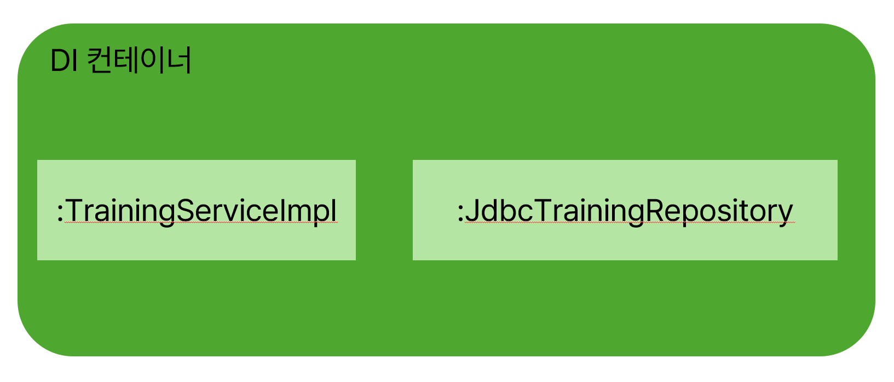
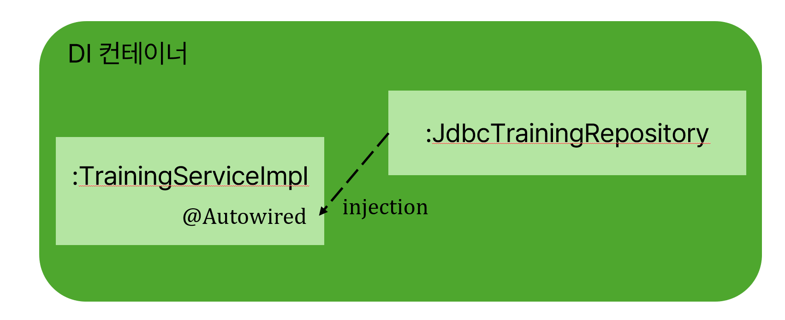
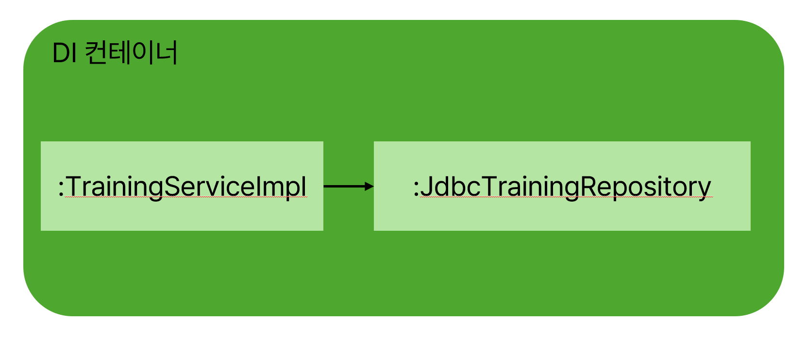

# 스테레오타입 애너테이션
| Bean으로 관리하고 싶은 구체적인 클래스에 붙이는 애너테이션으로 스프링이 생성자를 호출하고 객체를 생성한 뒤 Bean으로 관리

## 종류
|스테레오타입 애너테이션|설명|
|--|--|
|@Serivce|Service의 구상 클래스에 붙인다 부가기능은 없다|
|@Repository|Repository의 구상 클래스에 붙인다 부가 기능으로 데이터베이스 접속 관련 예외를 스프링이 제공하는 예외로 변환할 수 있다|
|@Controller|Controller의 구상 클래스에 붙인다 부가 기능으로 스프링 MVC기능을 이용할 수 있다|
|@Component|역할을 나타내지 않은 범용적인 스테레오타입 애너테이션으로 구상 클래스의 역할이 위의 항목에 해당하지 않는 경우 붙인다|

? 그럼 왜 @Servcie에 @Component말고 @Serivce를 붙이나요 

! 어느 쪽을 사용해도 상관 없으나 구상 클래스의 역할을 알 수 있어 소스코드의 가독성이 좋아지기 때문
**예시**
```java
@Service
public class TrainingServiceImpl implements TrainingService{
  ...
}
```

```java
@Repository
public class JdbcTrainingRepository implements TrainingRepository{
  ...
}
```

- 각 클래스의 생성자가 호출되어 객체 생성되어 DI컨테이너에서 Bean으로 관리

## Injection 지시
애너테이션으로 객체를 생성은 했으나 의존하는 객체에 대한 injection은 아직 이루어지지 않았음

-> DI 컨테이너에 injection은 `@Autowired`로 사용




## 컴포넌트 스캔
- 스테레오 타입을 붙이고 컴포넌트 스캔을 해야만 Bean으로 관리됨!
- Configuration 클래스에 `@ComponentScan`을 붙여야함!
```java
@Configuration
@ComponentScan
public class TrainingApplication {
  ...
}
```
- ComponentScan를 가지고 있는 패키지 ~ 하위 패키지까지 컴포넌트 스캔 진행
  - ComponentScan의 출발점이 되는 패키지 : **베이스패키지**
  - 베이스 패키지를 명시적으로 지정도 가능 `@ComponentScan("com.example.training")`

## DI 컨테이너를 생성하고 Bean 가져오기
| AnnotationConfigApplicationContext 클래스로 DI컨테이너 생성하기

```java
public static void main(String[] args) {
  ApplicationContext context = 
    new AnnotationConfigApplicationContext(TrainingApplication.class);
}
```
- `AnnotationConfigApplicationContext`는 DI 컨테이너의 객체를 생성하는 구상클래스
- 생성자의 인수로 JavaConfig 클래스 전달

**생성과정**
1. 생성하면서 JavaConfig의 설정정보를 불러온다
2. JavaConfig에 @ComponentScan이 있으므로 컴포넌트 스캔 진행
3. 스테레오타입 애너테이션이 있는 객체들은 Bean으로 생성되어 관리
4. @Autowired가 있으면 인젝션도 이루어짐
5. DI 컨테이너 생성 완료

**Bean가져오기**
```java
...
ApplicationContext context = 
    new AnnotationConfigApplicationContext(TrainingApplication.class);
TraingService trainingService = context.getBean(TrainingService.class);
trainingService.findAll();
...
```
- DI 컨테이너의 객체를 context에 저장하고 원하는 bean을 가져올 수 있음

## 인젝션 방법
### 생성자 인젝션
| 생성자의 인수로 의존 객체를 전달받는 방법
```java
@Serivce
public class TrainingServiceImpl implements TrainingService {
  private TrainingRepository trainingRepository;

  @Autowired
  public TrainingServiceImpl(TrainingRepository trainingRepository) {
    this.trainingRepository = trainingRepository;
  }
}
```
- DI컨테이너가 생성자를 호출할 때 인수의 타입과 일치하는 Bean을 전달
- 만약 생성자가 하나라면 @Autowired생략 가능

### Setter 인젝션
| Setter의 메서드의 인수로 의존 객체를 injection 하는 방법
```java
@Serivce
public class TrainingServiceImpl implements TrainingService {
  private TrainingRepository trainingRepository;

  @Autowired
  public void setTrainingServiceImpl(TrainingRepository trainingRepository) {
    this.trainingRepository = trainingRepository;
  }
}
```
### 필드 인젝션 
| 필드에 직접 injection하는 방법
```java
@Serivce
public class TrainingServiceImpl implements TrainingService {
  @Autowired
  private TrainingRepository trainingRepository;
}
```

? 그렇다면 어떤 방법을 써서 injection을 해야할까

! **생성자 인젝션**을 권장

- final을 붙힐 수 있음
- final은 생성자 외의 다른 곳에서는 내용을 변경할 수 없음 즉, 실수로 필드 내용을 변경하지 못하게 할 수 있음
- DI 컨테이너에서 준비해준 의존 객체는 개발자가 마음대로 변경해서는 안됨!!
- final로 선언이후 bean의 내용을 변경하려하면 컴파일 에러 발생

