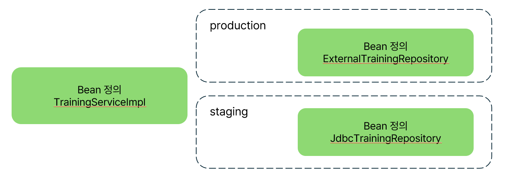

# Ch 6 프로파일로 설정 전환하기
## 프로파일이란?
    설정을 그룹화하는 DI 컨테이너의 기능
    ex) 프로덕션 환경, 스테이징 환경 등

## 환경별 프로파일


이렇게 환경별 프로파일을 나누면
- production에서는 trainingServiceImpl, ExternalTrainingRepository의 Bean정의 사용
- staging에서는 trainingServiceImpl, JdbcTrainingRepository의 Bean정의 사용

## 프로파일 사용법
    @Profile을 스테레오타입 애너테이션과 함께 사용

```java
@Repository
@Profile("production")
public class ExternalTrainingRepository implements TrainingRepository {
  ...
}
```
```java
@Repository
@Profile("staging")
public class JdbcTrainingRepository implements TrainingRepository {
  ...
}
```
```java
@service
public class TrainingServiceImple implements TrainingService {
  ...
}
```

## 활성화할 프로파일 지정하기
| IDE에서 실행할 때는 사용하는 경우 java 커맨드를 사용하지 않지만 서버 머신에서 실행할 때는 java 커멘드를 사용하는 경우가 많다 

- java 커맨드로 지정
  - `java -Dspring.profiles.active = 프로파일 이름 main 메서드를 가진 클래스 이름`
- 운영체제의 환경변수 이용하는 경우
  - 리눅스
   `export SPRING_PROFILES_ACTIVE=프로파일 이름` `java main 메서드를 가진 클래스 이름`
  - Windows `set SPRING_PROFILES_ACTIVE=프로파일 이름` `java main 메서드를 가진 클래스 이름`