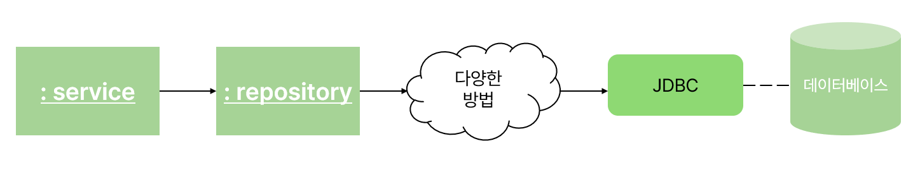
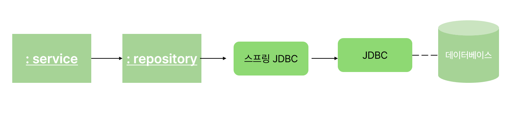

# Ch 8 스프링 JDBC : 데이터베이스 접근

## 스프링과 데이터 접근
**스프링에서 사용할 수 있는 데이터 접근 방식**
- 다른 라이브러리와 연동
  - JPA, MyBatis 등
  - 스프링 트랜잭션 기능과 연동 가능, 데이터베이스 접근 시 발생하는 예외를 스프링의 예외로 변환 가능
- 스프링 데이터
  - Repository의 구상 클래스 자동 생성해줘서 개발자는 Repository interface만 작성을 하면 DI 컨테이너 생성 시 메모리상에 구상 클래스(완전히 구현된)를 생성
  - 스프링 데이터 JPA, 스프링 데이터 MongoDB 등이 있음
- 스프링 JDBC

## 자바와 데이터베이스 접근

- 어떤 데이터베이스 접근 방식을 사용하더라도 내부에서는 자바 표준 JDBC 사용
- 고급 기능을 사용할수록 Repository와 JDBC사이의 처리가 무거워져 처리속도가 느려짐

## 스프링 JDBC란?
> 스프링이 제공하는 데이터베이스 접근 기능으로 자바가 표준으로 제공하는 JDBC를 wrapping하여 JDBC를 사용할 때 중복되는 처리를 대신 해줌
- 단순히 중복처리를 대신 해주는 것으로 속도의 차이는 없음
- 개발자는 스프링 JDBC가 제공하는 API를 사용하여 데이터베이스 접근 수행


## JDBC와 스프링 JDBC 비교
### JDBC 코드
```java
public void insert(Training training) {
    try (
            Connection con = dataSource.getConnection();
            PreparedStatement stmt = con.prepareStatment(
                    "INSERT INTO training VALUES(?,?,?,?,?,?)");
        ) {
        stmt.setString(1, training.getId());
        stmt.setString(2, training.getTitle());
        stmt.setString(3, training.getStartDateTime());
        stmt.setString(4, training.getEndDateTime());
        stmt.setString(5, training.getReserved());
        stmt.setString(6, training.getCapacity());
        } catch (SQLException ex) {
            if(ex.getErrorCode() == 23505) {
              throw new SameKeyException("키 중복");
            }
            throw new SystemException("INSERT 실패", ex);
        }
}
```
1. try-with-resources문으로 connection, preparedstatement 객체를 가져와 반드시 사용이 끝나면 닫아준다
2. SQL ? 부분에 해당하는 파라미터를 저장
3. 데이터베이스에 실행
- 해당 코드에서 고유처리는 SQL 과 파라미터를 지정하는 부분이고 나머지는 모두 정형화 + 중복된 코드

### 스프링 JDBC 코드
```java
public void insert(Training training) {
    jdbcTemplate.update("INSERT INTO training VALUES("?,?,?,?,?,?"),
        training.getId(),
        training.getTitle(),
        training.getStartDateTime(),
        training.getEndDateTime(),
        training.getReserved(),
        training.getCapacity());
}
```
- update 메서드내에서 connection객체, preparedStatment 객체 획득 및 닫기, SQL 실행, 오류 발생 시 오류 원인에 따른 비검사 예외로 변환하여 던지기 등 수행
- 고유의 처리만 작성하면 되도록 변경

## 스프링 JDBC 활용 사례
- 사실 스프링 JDBC보단 다른 기술을 채택하는 개발 프로젝트가 더 많다
❓  그렇다면 언제 스프링 JDBC를 사용하는 것이 좋을까?
❗ 
1. 처리 속도를 최대한 높이고 싶은 경우
2. JDBC에 익숙한 베테랑 개발자가 많은 경우
3. 레거시 애플리케이션을 리팩터링하는 경우

## JdbcTemplate 클래스 사용 예제

